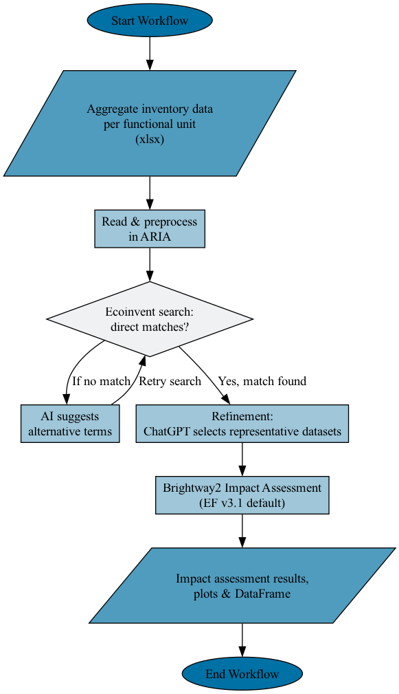

# Summary
'ARIA' (Artificial Intelligence for Sustainability Assessment) is a Python package designed to streamline the calculation of environmental impacts based on the life cycle assessment (LCA) framework. It leverages Brightway2 [@mutel2017brightway] as its core infrastructure, enabling robust LCA modelling while automating several steps that traditionally require tedious manual effort. 'ARIA' utilises a large language model to match foreground system inputs and outputs (often called “activities”) to the appropriate background datasets based on user-defined instructions. Rather than painstakingly searching for relevant processes in LCA databases such as Ecoinvent [@wernet2016ecoinvent], ARIA uses a large language model to suggest possible matches and alternative search terms, making the flow mapping process faster and less prone to errors. This automation frees LCA practitioners from manual inventory selection, one of the most time consuming steps in LCA. Once activities are connected to inventory data, ARIA seamlessly executes impact assessment, drawing on multiple LCIA methods available in Brightway2 to calculate environmental indicators (e.g., global warming potential, acidification, water use). It then provides convenient visualisation and plotting functionality, allowing users to quickly interpret results. Overall, ARIA offers a modular, user-friendly Python interface for LCA, integrating advanced capabilities in background inventory searching and automatic impact assessment to foster reproducible and efficient sustainability assessment.

# Statement of need
Life Cycle Assessment (LCA) is a methodology that quantitatively and qualitatively evaluates the environmental impacts of products and processes across their entire life cycle—from raw material extraction, manufacturing, and distribution to use and end-of-life. Formally described by the ISO 14040/44 standards [@finkbeiner2006new], LCA typically proceeds through four main phases: (1) goal and scope definition, (2) inventory analysis, (3) impact assessment, and (4) interpretation. Although LCA is highly quantitative, it inherently involves qualitative judgments associated with the goal and scope definition. For example, practitioners must define the product under study and the geographical focus in order to select datasets that best represent their product system during the inventory analysis phase. This dual nature of the methodology has traditionally required extensive manual effort and deep domain expertise.

Inventory analysis is widely recognised as the most time consuming and expertise intensive phase in an LCA study, often consuming up to 80% of the total project time, which can range from several weeks to months depending on the complexity of the product system [@hauschild2018life]. LCA practitioners frequently spend significant time searching for appropriate background datasets in extensive databases such as Ecoinvent [@wernet2016ecoinvent]. For example, if a practitioner determines that their product system requires x kWh of electricity or y kg of a specific chemical, they must manually locate representative datasets that represent the embodied environmental impact of these inputs. This important yet tedious step demands finding datasets with the appropriate geographical, technological, and temporal scope, a task that often relies on deep domain knowledge of both LCA and the specific product system.

Brightway2 [@mutel2017brightway]  has been a transformative force in the LCA community by providing a robust, flexible, and open-source framework that facilitates detailed and reproducible assessments. Its open design allows direct interfacing with extensive databases such as Ecoinvent, laying a solid foundation for rigorous LCA modeling. Given that Brightway2 is more targeted towards the advanced user, the Activity Browser [@steubing2020activity] introduced a user-friendly interface to perform LCA, making common tasks easier and more intuitive.   

ARIA complements such open-source LCA software by introducing a natural language processing layer that draws drom the qualitative dimensions of goal and scope definition to rapidly quantify environmental impacts based on Brightway2. It utilises the OpenAI API [@openai_api] to propose suitable datasets to represent the background system based on a set of default and user-defined rules.
ARIA’s automation extends beyond simple dataset retrieval by incorporating contextual information from the goal and scope definition, such as geographical focus or technological dimensions, to refine dataset selection. This qualitative dimension, where the practitioner’s context and decisions directly influence the matching process, is frequently overlooked by purely quantitative tools. ARIA aims to make a valuable contribution to the open source LCA software landscape by accelerating inventory analysis and ultimately reducing the barrier to entry of LCA software. 

# Operating Principles
ARIA has been developed to automate the calculation of environmental impacts for a product or process. Rather than manually mapping each flow (e.g., material, energy use, transport) to an LCA dataset, ARIA integrates Brightway2 with AI-based search and refinement to streamline inventory analysis and impact assessment. Figure 1 provides a conceptual overview.

**Figure 1.** Schematic representation of the ARIA workflow depicting data processing, iterative matching, AI refinement, and impact assessment stages.
1. Data input (foreground system)
The user aggregates all product system inputs (mass flows, energy requirements, transport processes, etc.) in a spreadsheet named data_inputs.xlsx. Each row corresponds to a flow (e.g., “5 kg steel,” “10 kWh electricity”), ideally using ecoinvent-compatible units (e.g., kg, kWh, MJ) which are shown in the [European Platform on LCA website](https://eplca.jrc.ec.europa.eu/SDPDB/unitgroupList.xhtml;jsessionid=D0082C0606540373127C80107958A6E6?stock=default). The user can also include facility requirements (e.g., inert gases, water usage) if they factor into the functional unit.

2. Initial database search
Once the data are imported, ARIA performs a first scan in the Ecoinvent database for each flow, applying filters such as location or user criteria. If a direct match is found (e.g., “market group for electricity, medium voltage” for an electricity flow), it is recorded.

3. AI-Based alternative terms
If no direct match appears, ARIA calls the OpenAI API [@openai_api] to generate three alternative search terms taking into account any notes provided by the user. For example, a user’s input “waste li-ion pack” might yield “spent lithium-ion batteries,” “EOL lithium-ion cell,” or “lithium-ion battery scrap.” ARIA retries the database search with these suggestions, significantly increasing the chance of finding relevant datasets. However, it is not guaranteed to produce a match in every case and this can become an iterative excercise. 

4. Dataset Refinement with ChatGPT
After a set of potential matches is identified for each flow, ARIA enters a refinement step:
ChatGPT is prompted with generic rules (e.g., “avoid ‘production’ datasets for a ‘waste’ flow”) and optionally with user-supplied constraints derived from the goal and scope definition.
The large language model then selects the most representative dataset from the list. Figure 1 offers a snapshot of this logic, showing how rules and user context guide ChatGPT to refine the match.

5. Building the inventory and performing impact assessment
Once each foreground flow is matched to a background dataset, ARIA prints a DataFrame showing all necessary information, i.e. name, location, quantity, etc. Next, it automatically performs life cycle impact assessment using Brightway2. By default, the Environmental Footprint v3.1 characterisation method [@andreasi2023updated] is implemented, being one of the more recent methods available), but the user can specify any Brightway-supported impact assessment method. ARIA calculates each flow’s contribution to environmental indicators (e.g., global warming potential, acidification, ecotoxicity) and plots waterfall charts for easy visualisation.

# Author contributions
E.K. conceptualised the project, developed the software and packaged it for publication. G.O. and J.E. actively supervised the project. All authors reviewed and edited the manuscript.  

# Acknowledgments
This work was financially supported by the Faraday Institution ReLiB project (grant number FIRG057). Support from the Imperial College London Research Software Engineering (RSE) is acknowledged. 

# References

